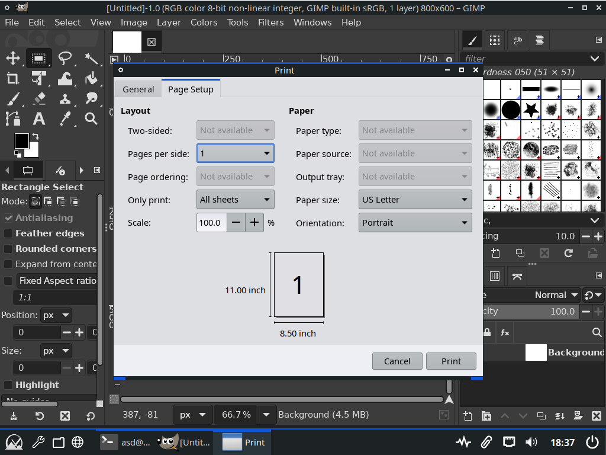
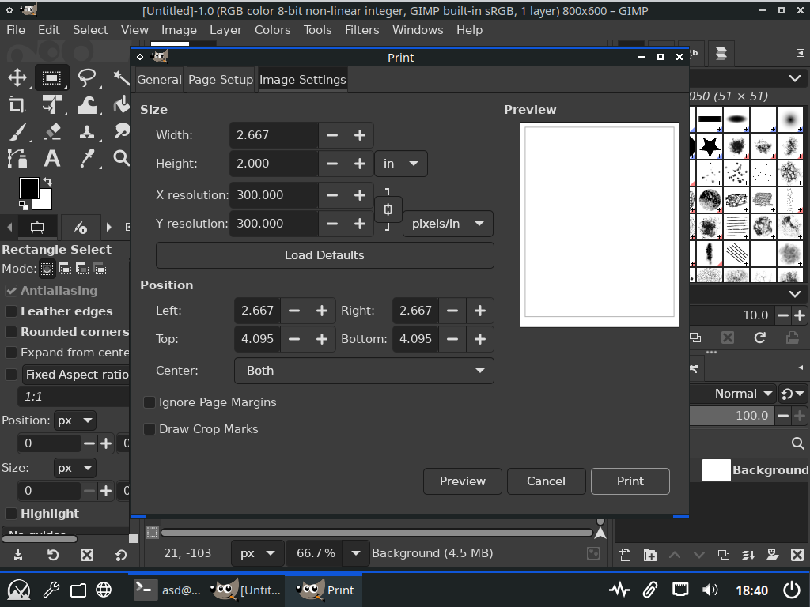

<h1>gtk-3-no-portal-cheat</h1>

make gtk 3 not use <a href="https://wiki.archlinux.org/title/XDG_Desktop_Portal?useskin=vector">portals</a> for dialogs

<table>
<tr><th>before</th><th>after</th></tr>
<tr><td></td><td></td></tr>
</table>
<h2>how to use</h2>

I have <code>gtk-3-no-portal-cheat.so</code> in <code>/home/asd/a</code> folder and I want <code>org.gimp.GIMP.Nightly</code> flatpak to not use portals.

if you want <i>gtk-3-no-portal-cheat</i> by default:

<ul><li>run<pre>flatpak override --user --filesystem=/home/asd/a/gtk-3-no-portal-cheat.so:ro --env=LD_AUDIT=/home/asd/a/gtk-3-no-portal-cheat.so org.gimp.GIMP.Nightly</pre></li></ul>

if you don't want <i>gtk-3-no-portal-cheat</i>:

<ul><li>(this resets all <code>org.gimp.GIMP.Nightly</code> flatpak overrides if they exist, for granular override editing use <a href="https://flathub.org/apps/com.github.tchx84.Flatseal"><i>flatseal</i></a>) run<pre>flatpak override --user --reset org.gimp.GIMP.Nightly</pre></li></ul>

if you want <i>gtk-3-no-portal-cheat</i> once:

<ul><li>run<pre>flatpak run --filesystem=/home/asd/a/gtk-3-no-portal-cheat.so:ro --env=LD_AUDIT=/home/asd/a/gtk-3-no-portal-cheat.so org.gimp.GIMP.Nightly</pre></li></ul>
<h2>how to compile</h2>

I have repository files in <code>/home/asd/a</code> folder.

<ol>
<li>install <a href="https://flathub.org/apps/org.freedesktop.Sdk"><code>org.freedesktop.Sdk</code> flatpak</a></li>
<li>run<pre>flatpak run --filesystem=/home/asd/a --cwd=/home/asd/a org.freedesktop.Sdk build.sh</pre>(this creates <code>/home/asd/a/gtk-3-no-portal-cheat.so</code> file)</li>
</ol>
